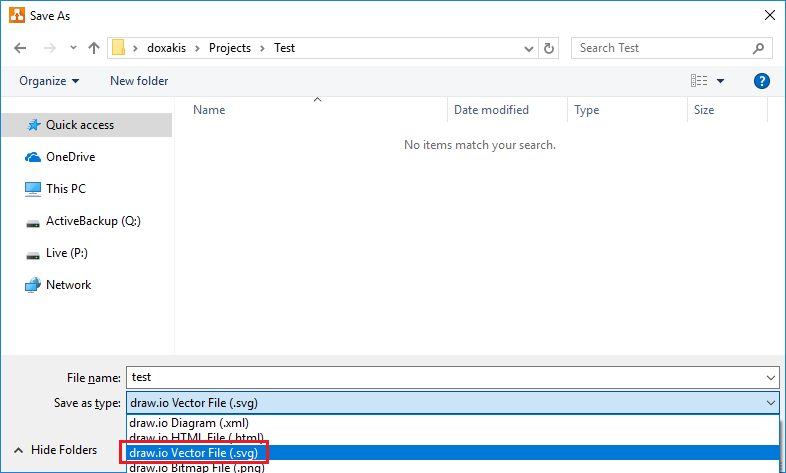

# draw.io integration in readme file
According to https://github.com/jgraph/drawio-github, there is multiple GitHub integration. One of them is SVG file with embedded PNG data. This format give us the possibility to use ``

Here is an example :

# Steps

Make sure to install "draw.io Desktop". (So, you can keep your graph offline.)

In the readme.md file, you can use ``.

This is not specific to GitHub. For example, it works fine for bitbucket. You could use it everywhere. You can version control the graph and reference diagrams.

# Copyright and license
Code released under the MIT license.